# DevOps CI/ CD Project 1:

---

#### Project Architecture:

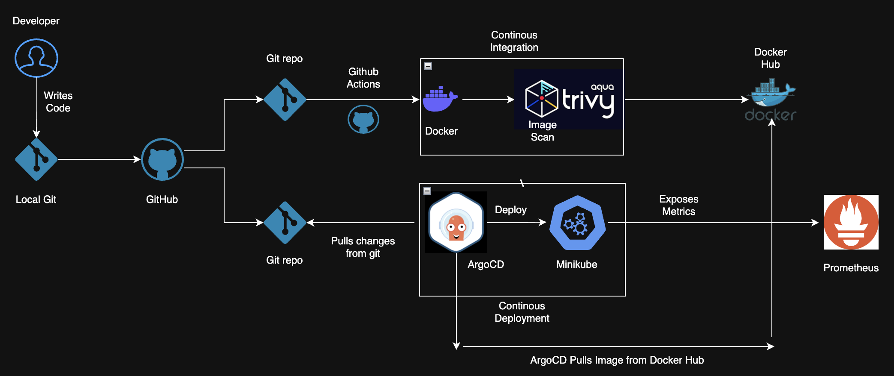

#### Project Introduction:

I built an end-to-end DevOps pipeline focused on real-world system design rather than just tool usage. The project is based on a microservices architecture using Node.js, where services communicate with each other to simulate production-like behavior.

I containerized the applications using Docker and deployed them on Kubernetes (Minikube), implementing service discovery and exposing them externally through Ingress. I then integrated GitOps using ArgoCD, ensuring that the cluster state is always in sync with Git, eliminating manual deployments.

To make the system observable, I exposed Prometheus metrics from the application and began monitoring system behavior. Along the way, I intentionally introduced failures and debugged issues across multiple layers, gaining a deeper understanding of how distributed systems behave in real-world scenarios.

---

#### Project Folder Structre:

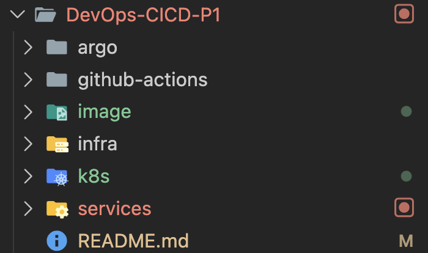

---

#### Local Deployment Test:

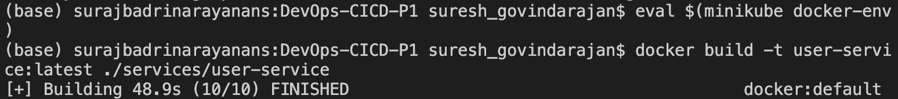

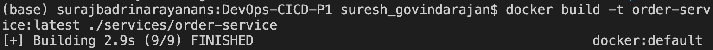

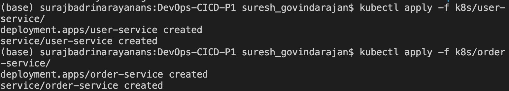

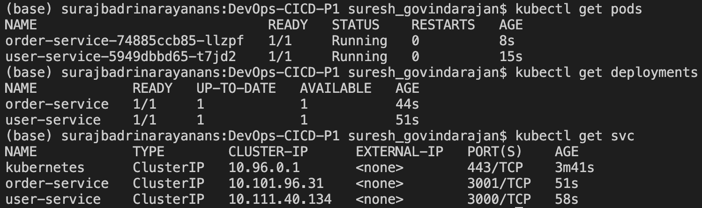

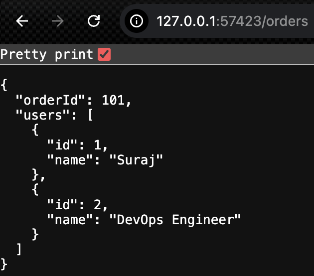

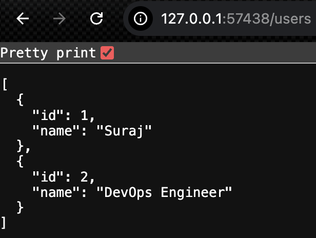

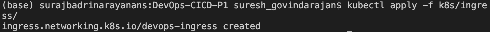

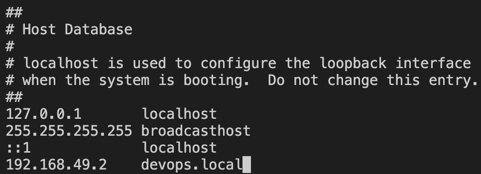

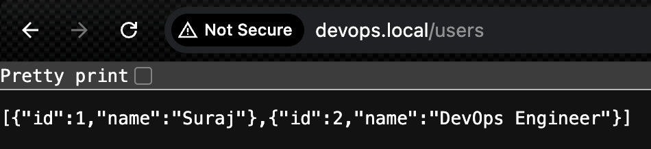

---

#### GitOps Approach for Continuous Deployment:

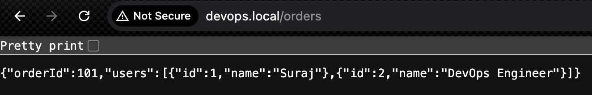

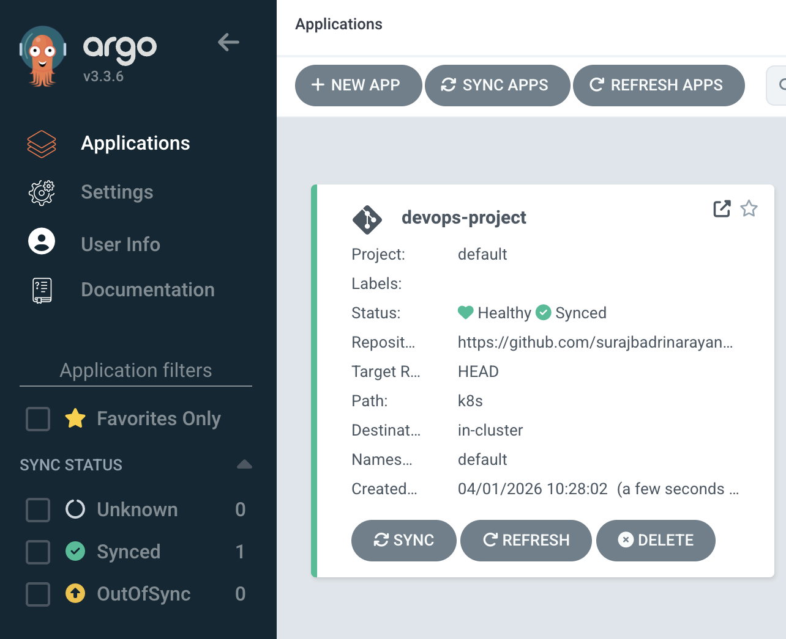

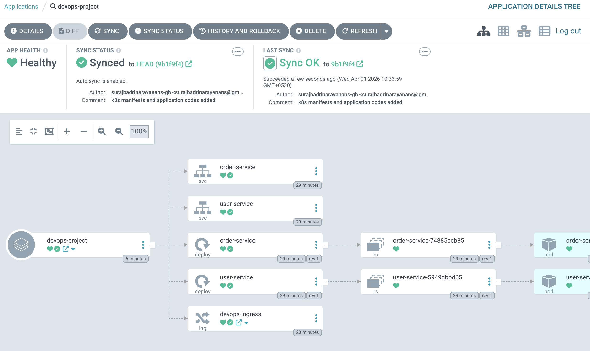

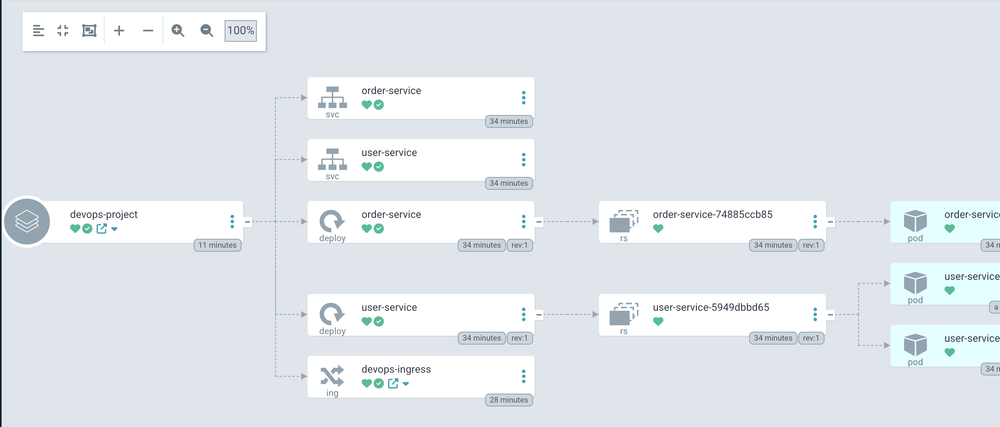

---

#### Continous Integration 

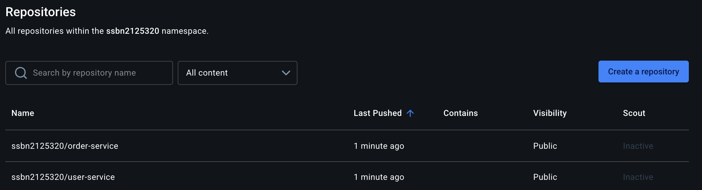

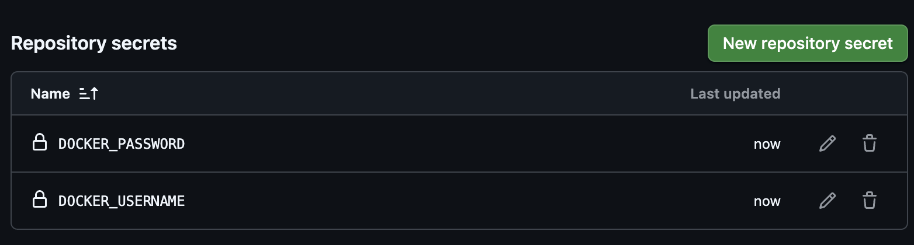

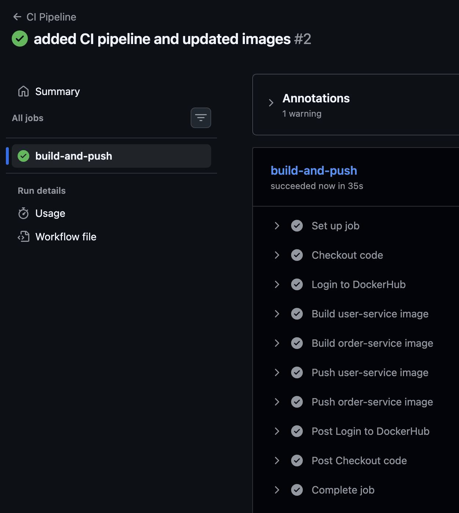

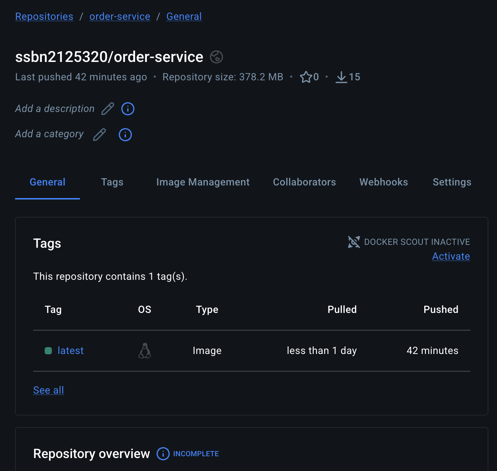

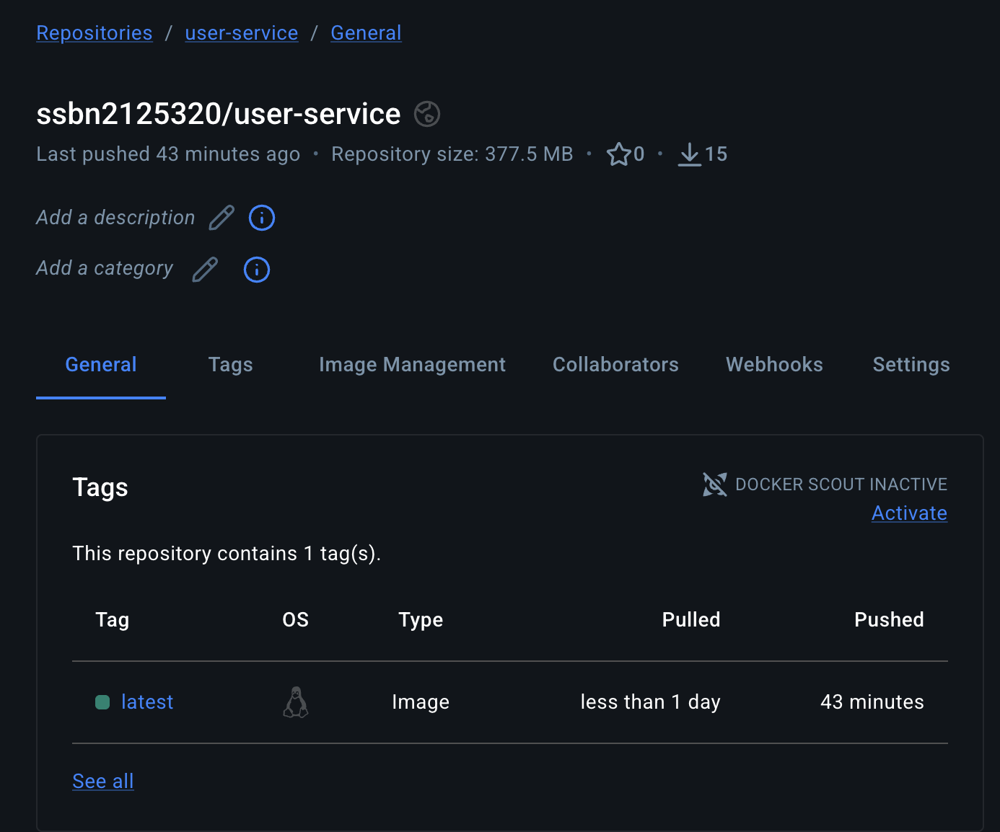

---

#### Metrics Endpoints for Monitoring:

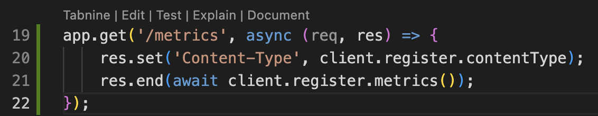

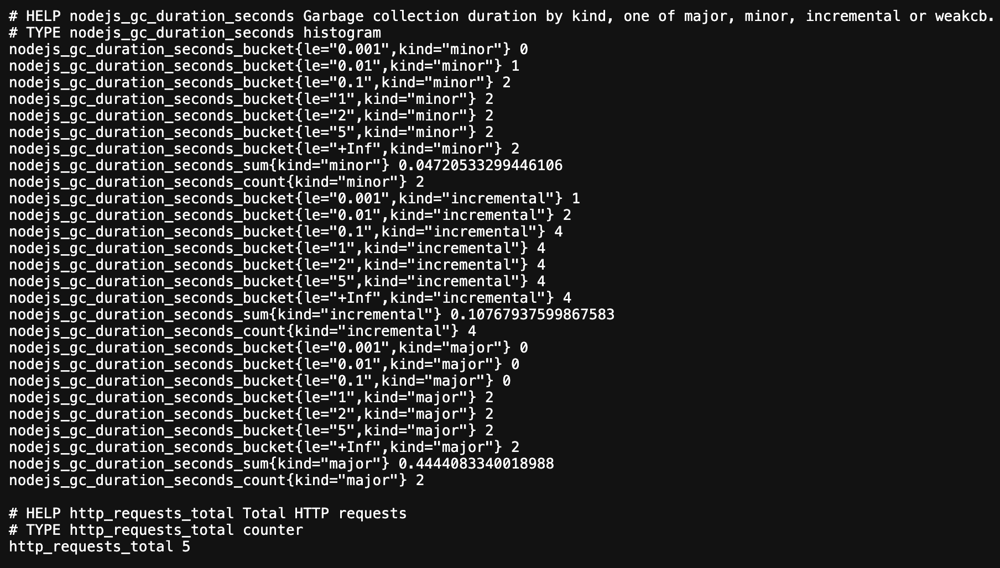

---
